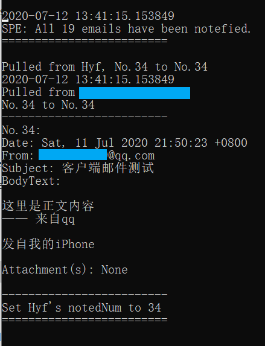
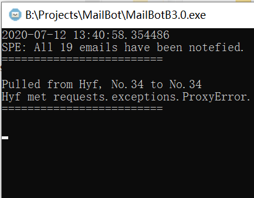

# Telegram 邮件提醒机器人

Telegram eMail bot

@author NandHyf


> 出于兴趣和移动端没有什么太好的邮件客户端😥所以尝试着用Python写了一个邮件提醒机器人，由于不是很了解邮件的具体原理所以为了保险采用了POP协议拉取邮件，所以不会对信件本身有什么的危险，也是在做这个项目的时候对程序设计有了更深一步的理解，当作是个学习积累的成果分享出来，如果喜欢的话还请点个star🌟予以支持，非常感谢😉


> 针对这个项目的详细解读、debug总结以及总结思考欢迎进入我的个人博客或CSDN阅读相关内容
>
> Blog👉[待更新]
>
> CSDN👉[待更新]


## ⚠功能定位

本机器人的功能被定位为**邮件提醒**，而不是接收❌或发送邮件❌，目前它能做到的仅仅是被部署在某个平台上，然后定时的拉取**多个信箱**✔的**多个邮件**✔，如果有新邮件则通过**一个bot**向指定的**一个**```chat_id```发送一个包含基本信息的提醒消息，其中同一个信箱的多个邮件会被合并为一条消息发送（当然消息内容是有做分隔处理的，还是比较方便阅读的，相关内容下文会详细讲解）

### 关于消息文本

邮件内容将被解析并拼接为以下形式进行推送

```txt
2020-07-12 12:31:50.371531
Pulled from recipient@example.com
No.1 to No.3
-------------------------
No.1:
Date: Mon, 15 Jun 2020 12:57:42 0800
From: sender1@example.com
Subject: Hello eMail!
BodyText:

你好！
这里会是邮件的"Content-Type: text/plain"中的内容
(也就是文本的正文内容)
"Content-Type: text/html"中的内容因为不能被合并为文本信息因此不会被解析

Attachment(s): Yes, (1)
	author:NandHyf.txt
-------------------------
No.2:
Date: Tue, 16 Jun 2020 12:57:42 0800
From: sender2@example.com
Subject: No bodyText && NO attachment
BodyText:

(None)

Attachment(s): None
-------------------------
No.3:
Date: Wed, 17 Jun 2020 12:57:42 0800
From: sender3@example.com
Subject: No bodyText && 2 attachments
BodyText:

(None)

Attachment(s): Yes, (2)
	MailBot.py
	MailBot.toml
```


## 开始使用

在提供源码的同时我还打包了两个可执行文件，分别是对应Windows平台的```.exe```和Ubuntu20.04下这两个可执行文件无需下载其他"轮子"，直接解压后运行即可。

对于下载源码的话则需要下载额外的文件以运行程序。

以下配图的演示均为```.exe```版本的演示，内容应当与在编辑器中调试启动**并无不同**，请放心阅读。

### 运行源码

**编写时Python版本是```3.8.3```⚠**

### 准备工作

首先需要下载运行程序所需的文件

```txt
pip3 install toml
pip3 install python-telegram-bot
```

然后在编辑器里调试启动或者命令行启动（可能会有点慢）

会提示缺少配置文件```MailBot.toml```，此时直接输入```"y"```就可以自动生成一个配置文件模板


创建完成后程序会自动退出，此时就可以看到在目录下面多出来一个```MailBot.toml```，这就是程序的配置文件，使用文本编辑器打开进行配置：


修改替换相关的位置比如：

- 填入```token```和```chaId```
- 修改收取间隔```golbalTimer```（**以分钟为单位的```int```类型**）
    - 如果有多个邮箱即每个邮箱的收取间隔都是相同的```globalTimer```中的时间，顺序由上至下以邮箱为单位依次收取、推送
- 将```"box1"```替换为邮箱的备注名
- 根据具体情况替换```ssl```, ```host```, ```userName```, ```passWd```, ```notedNum```
    - ```ssl```需要根据邮箱设定进行修改，数值是**布尔(boolean)类型**
    - ```host```是需要连接的**运营商的服务器地址**，例如腾讯企业邮的```host```是```pop.exmail.qq.com```
    - ```userName```最好**填写完整**，例如```xxxxxx@qq.com```
    - ```notedNum```是已经提醒过的邮件数量，因为本机器人只是使用累计计数的方式进行统计，不过如果不记得的话从0开始让程序执行一次过后也会自动改为最新的数值
        - 不过需要注意的是：拉取到的邮件数量**会受到邮箱设置的影响⚠**，如果邮箱限制拉取为```最近30天```时会影响数量对应的邮件，**可能会因为可拉取的邮件数量小于```notedNum```而导致不发送提醒⚠**，但并不会影响邮箱内的邮件（由于采用的pop协议）；如果采用机器人的话建议开启```收取全部```选项（一般在邮箱的```"账户"```或者```""收取设置"```菜单下）
        - 

### 开始工作

程序会根据```MailBot.toml```中的顺序以邮箱为单位依次地拉取邮件，如果拉取的数量**等于或小于**本地的```notedNum```则**不会进行推送**，仅打印下图中的两条信息（"SPE"和"Hyf"是我演示用的两个邮箱的备注名，即"box1"的位置）


可以看到"Hyf"邮箱的情况就是拉取得的数量小于了本地```notedNum```的数量，因此重新设定本地```notedNum```为拉取得的数量，同时打印```Set xxx's notedNum to xx```

当拉取得的数量大于```notedNum```时程序也会在推送完成后将其修改为最新的数值



### ⚠代理错误😥

当然，在调试运行的时候就出现了代理错误导致的无法发送问题，对此我的解决方案是程序中针对代理错误的异常处理是先打印出问题，然后设定定时器（函数）在10秒后重新启动新一轮的拉取、推送；范围当然还是重新从上至下地拉取每个邮箱，不过如果前面的邮箱已经成功推送的话**不会重复推送**的，因为只有推送成功后才能修改```notedNum```的值，但是确实代理错误可能会导致邮箱推送顺序的不同，但个人认为并没有什么影响 。

**不过如果科学上网不受影响的直接运行或者部署在VPS上就不太可能遇到相关问题**

图示：遇到代理错误：



图示：程序自行解决代理错误：


### 在Telegram上查看消息!


### 项目地址

[NandHyf/Telegram-email-bot](https://github.com/NandHyf/Telegram-email-bot)

### 参考资料

[邮件的发送与接收原理 - CSDN/行者-traveller](https://blog.csdn.net/u014520047/article/details/51966628)

[Doc: poplib - POP3 protocol client](https://docs.python.org/3/library/poplib.html#module-poplib)

[Doc: telegram.bot](https://python-telegram-bot.readthedocs.io/en/stable/telegram.bot.html)

[Python3 - 菜鸟教程](https://www.runoob.com/python3/python3-tutorial.html)

[Toml教程 - 龙腾道-译](https://github.com/LongTengDao/TOML/)

### 欢迎一起讨论新功能🧐

交流讨论👉📧heyufei@gwlk.icu